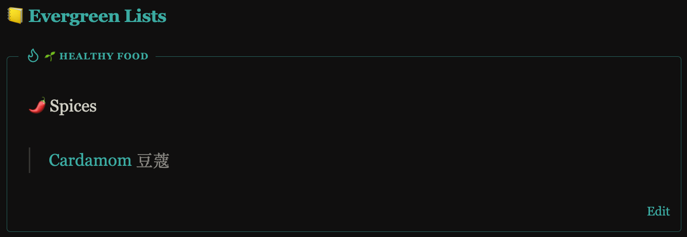

# Evergreen Lists

## About

This repository features a collection of [listicles](https://huami.ng/lists) that I curated over time. They are insights, tips, and resources too brief to stand alone as [notes](https://huami.ng/notes) or [essays](https://huami.ng/writing).

Each list is available in three formats: **Google Sheets**, **JSON**, and **Markdown**.

## How I Built This Project

I rely on [ Apple Reminders](https://support.apple.com/en-au/guide/reminders/welcome/mac) not only for task management, but also for note-taking. Its support for notes, URLs, and nested reminders makes it a powerful tool for organizing knowledge.

Inspired by the concepts of [incremental learning](https://www.google.com/search?q=incremental+learning) and [microlearning](https://www.google.com/search?q=microlearning), I automate [spaced repetition](https://www.google.com/search?q=spaced+repetition) to regularly review a random list item with minimum effort.

|  |
| :-: |
| This custom dashboard, powered by [Dataview](https://github.com/blacksmithgu/obsidian-dataview) in Obsidian, displays a random item from one of the <a href="https://huami.ng/lists">evergreen lists</a>. See the full code snippet <a href="https://github.com/huaminghuangtw/Second-Brain/blob/main/Homepage.md">here</a> (Search: “Evergreen Lists”). |

<https://shortcutomation.com/gallery/evergreen-lists/>

<https://shortcutomation.com/gallery/shared/evergreen-lists/>

## Overview

1. **[Shortcuts Dev Tip]([https://huami.ng/lists/](https://huami.ng/lists/shortcuts-dev-tip/)shortcuts-dev-tip/)**
2. **[AI Prompt](https://huami.ng/lists/ai-prompt/)**
3. **[Journal Prompt](https://huami.ng/lists/journal-prompt/)**
4. **[Keyboard Hotkey](https://huami.ng/lists/keyboard-hotkey/)**
5. **[Cheat Sheet](https://huami.ng/lists/cheat-sheet/)**
6. **[Tech Pro Tip](https://huami.ng/lists/tech-pro-tip/)**
7. **[Life Pro Tip](https://huami.ng/lists/life-pro-tip/)**
8. **[Home Exercise](https://huami.ng/lists/home-exercise/)**
9. **[Gym Workout](https://huami.ng/lists/gym-workout/)**
10. **[World Cuisine](https://huami.ng/lists/world-cuisine/)**
11. **[Healthy Food](https://huami.ng/lists/healthy-food/)**

## Contribution

Contributions are welcome! Please [open an issue](https://github.com/huaminghuangtw/Evergreen-Lists/issues/new) or [submit a pull request](https://github.com/huaminghuangtw/Evergreen-Lists/compare).
