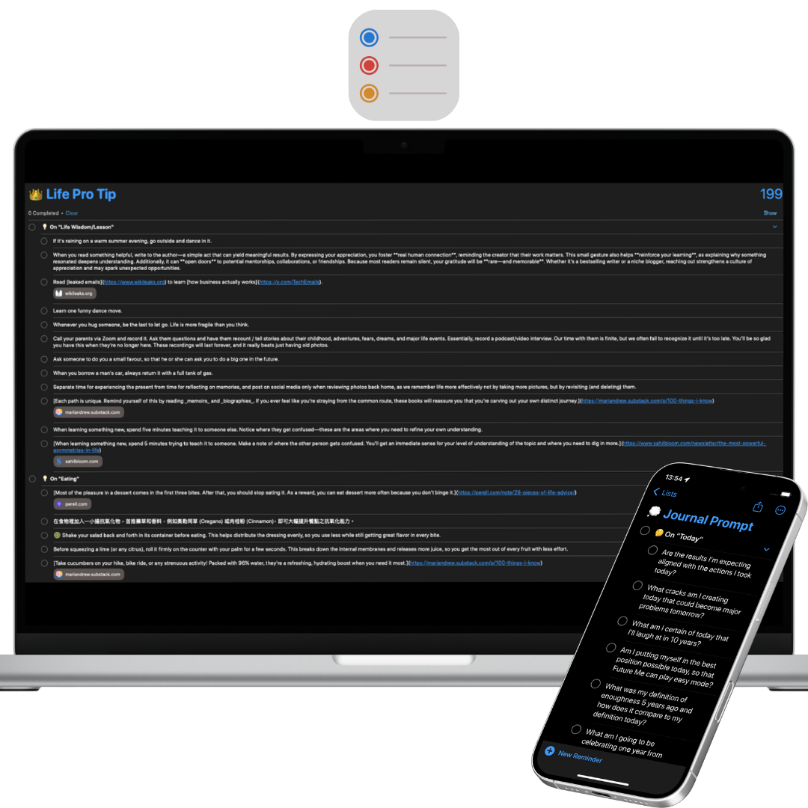

# Evergreen Lists

## About

This repository features a collection of [listicles](https://huami.ng/lists) that I've curated over time. They are insights, tips, and resources too brief to stand alone as [notes](https://huami.ng/notes) or [essays](https://huami.ng/writing).

You can explore and download these lists at [huami.ng/lists](https://huami.ng/lists). If you find this project useful, please consider supporting my work by [buying me a coffee](https://buymeacoffee.com/huaming.huang).

## Overview

1. **[Shortcuts Dev Tip](https://huami.ng/lists/shortcuts-dev-tip/)**
2. **[AI Prompt](https://huami.ng/lists/ai-prompt/)**
3. **[Journal Prompt](https://huami.ng/lists/journal-prompt/)**
4. **[Keyboard Hotkey](https://huami.ng/lists/keyboard-hotkey/)**
5. **[Cheat Sheet](https://huami.ng/lists/cheat-sheet/)**
6. **[Tech Pro Tip](https://huami.ng/lists/tech-pro-tip/)**
7. **[Life Pro Tip](https://huami.ng/lists/life-pro-tip/)**
8. **[Home Exercise](https://huami.ng/lists/home-exercise/)**
9. **[Gym Workout](https://huami.ng/lists/gym-workout/)**
10. **[World Cuisine](https://huami.ng/lists/world-cuisine/)**
11. **[Healthy Food](https://huami.ng/lists/healthy-food/)**

## How I Built This Project

I use [ Apple Reminders](https://support.apple.com/en-au/guide/reminders/welcome/mac) not only for _task management_, but also for _note-taking_. Its support for notes, URLs, and nested reminders makes it a powerful tool for organizing knowledge.

Whenever I come across something interesting, I add it to the relevant Reminder list. Every month, I use [ Apple Shortcuts](https://shortcutomation.com/gallery/evergreen-lists/share-evergreen-lists/) to export these items into three formats—**[Google Sheets](https://shortcutomation.com/gallery/evergreen-lists/evergreen-list-to-google-sheets/)**, **[JSON](https://shortcutomation.com/gallery/evergreen-lists/evergreen-list-to-json/)**, and **[Markdown](https://shortcutomation.com/gallery/evergreen-lists/evergreen-list-to-markdown/)**—all of which are available in this repository.

<a href="assets/mockup.png">
<kbd>

</kbd>
</a>

---

> _“Live to learn and you'll really learn to live.” — John C. Maxwell_

> _“Live as if you were to die tomorrow. Learn as if you were to live forever.” — Mahatma Gandhi_

Inspired by the concepts of [incremental learning](https://www.google.com/search?q=incremental+learning) and [microlearning](https://www.google.com/search?q=microlearning), I utilize the following tools to regularly retrieve and review these “Reminders”:

### Obsidian Callout

On desktop, I created an [Obsidian Callout](https://help.obsidian.md/callouts) with the [Dataview](https://github.com/blacksmithgu/obsidian-dataview) plugin to display a random item from one of the [evergreen lists](https://huami.ng/lists). For details, see the [full code snippet](https://github.com/huaminghuangtw/Second-Brain/blob/main/Homepage.md#-evergreen-lists).

<a href="assets/callout.png">
<kbd>

</kbd>
</a>

### Apple Shortcuts

On mobile, I used  Apple Shortcuts to implement and automate a flashcard system that incorporates the [spaced repetition](https://www.google.com/search?q=spaced+repetition) and [active recall](https://www.google.com/search?q=active+recall) techniques. Try [this shortcut](https://shortcutomation.com/gallery/shared/evergreen-lists/) for a demonstration.

<a href="assets/notification.jpg">
<kbd>

</kbd>
</a>

## Contribution

Contributions are welcome! Please [open an issue](https://github.com/huaminghuangtw/Evergreen-Lists/issues/new) or [submit a pull request](https://github.com/huaminghuangtw/Evergreen-Lists/compare).
